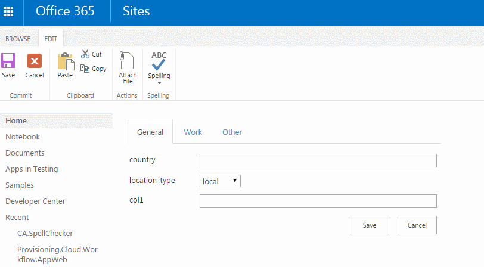

# SPTabs
### Simple js tools to group SharePoint fields by tabs on item forms

* Quick, based on CSS rules;
* No external dependencies.

Usage smaple:

	SPTabs([
		["General", ["Title", "country", "location_type", "col1"]],
		["Work", ["local language", "col2", "col3"]],
		["Other", ["Big Col Name 1", "Big Col Name 2", "Big Col Name 3", "Big Col Name 4", "Big Col Name 5"]]
	]);

Where `General` is the name of tab and `["Title", "country", "location_type", "col1"]` is a set of field DisplayNames.

How it looks like:

 
